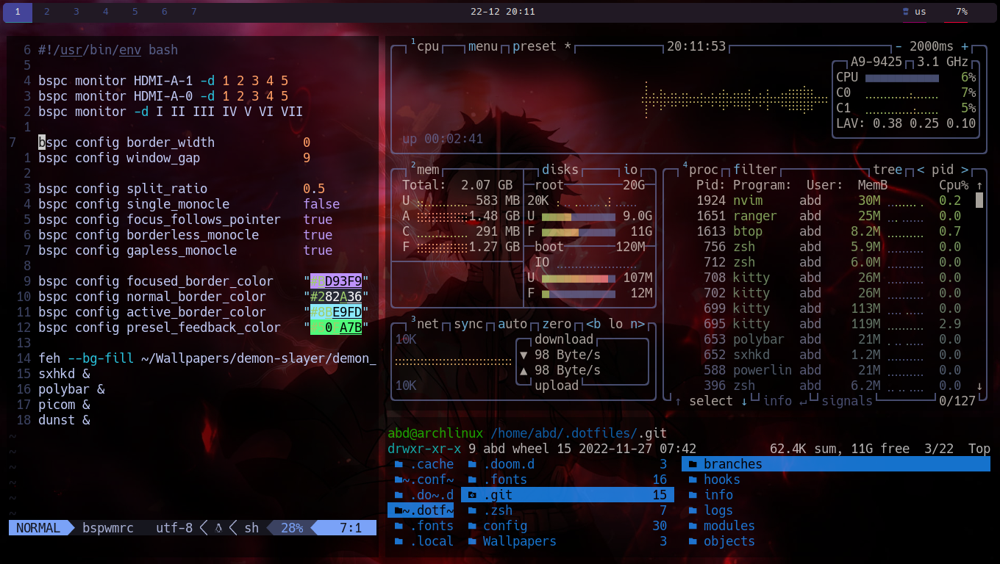

<h1 align=center>bspwm</h1>

---

## About

bspwm is a static tiling window manager that can be configured in _any language_, in this configuration it's configured in bash.
The keymaps/keybinds that bspwm uses is [sxhkd](../sxhkd/).

### Screenshot

