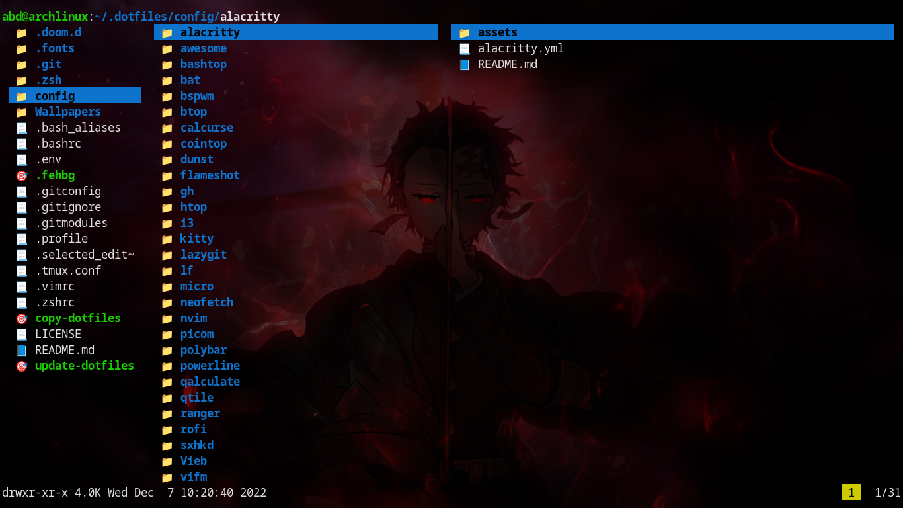

<h1 align=center>LF</h1>

---

## About 

LF is a file manager that's simple and very configurable. It uses bash as a configuring language & it has the ability to have icons as well (but you can change the icons freely).

### Screensot

